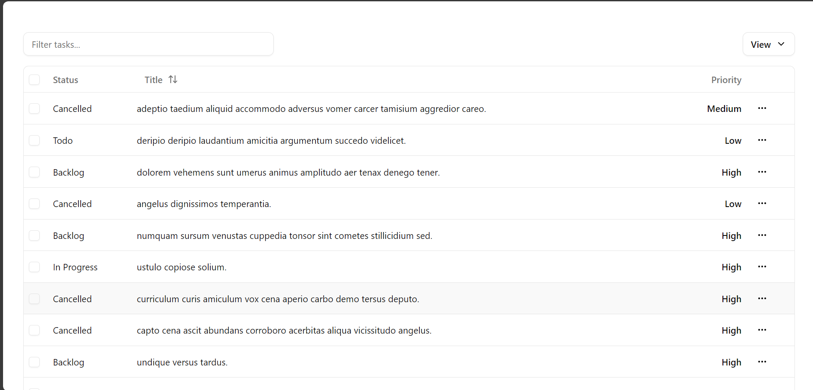

# Task Manager

[](https://task-manager-ch8o.onrender.com)

### [](https://task-manager-ch8o.onrender.com)

### Installation Steps

1. Clone the repository:

   ```bash
   git clone https://github.com/SaddamTechie/Group16-ecommerce.git ecommerce
   cd ecommerce
   ```

2. Install dependencies:

   ```bash
   npm run build
   ```

3. Set up the database:

- Either setup local database or mongo cloud.

4. Configure environment variables:

   ```env
   MONGO_URI=<YOUR_MONGODB_CONNECTION_STRING>
   PORT=8000
   ```

   Create a `.env` file in the root directory and add the above configuration.

5. Start the server:

   ```bash
   npm run start
   ```

6. Access the application at `http://localhost:8000`

## 📈 Future Implementations and Improvements

- User Authentication and Authorization
- Adding new tasks page.
- Task edit.

---

Made with ❤️ by [Saddam](https://saddamtechie.github.io/)

---

© 2025 [Task Manager.](https://task-manager-ch8o.onrender.com) All rights reserved.
